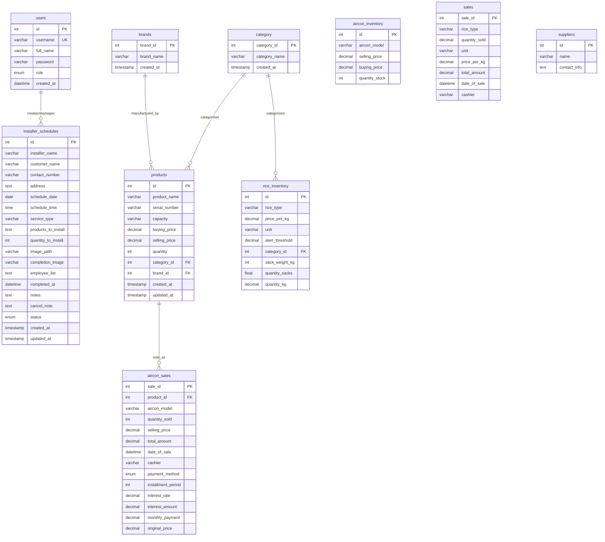

# Entity-Relationship Diagram (ERD) for AUS Database

## Database Schema Overview

This document provides a visual representation of the database structure for the AUS (Aircon Unit System) database.

## ERD Diagram

## Table Relationships

### Primary Relationships

1. **products → category**
   - Foreign Key: `products.category_id` → `category.category_id`
   - Relationship: Many-to-One (Many products belong to one category)
   - Constraint: ON DELETE (standard constraint)

2. **products → brands**
   - Foreign Key: `products.brand_id` → `brands.brand_id`
   - Relationship: Many-to-One (Many products belong to one brand)
   - Constraint: ON DELETE SET NULL

3. **aircon_sales → products**
   - Foreign Key: `aircon_sales.product_id` → `products.id`
   - Relationship: Many-to-One (Many sales records for one product)
   - Constraint: ON DELETE SET NULL, ON UPDATE CASCADE

4. **rice_inventory → category**
   - Foreign Key: `rice_inventory.category_id` → `category.category_id`
   - Relationship: Many-to-One (Many rice items belong to one category)
   - Constraint: ON DELETE SET NULL

### Logical Relationships (Not Enforced by Foreign Keys)

5. **users → installer_schedules**
   - Logical relationship: Users (especially installers) create/manage schedules
   - No foreign key constraint, but `installer_name` likely references users

6. **users → sales/aircon_sales**
   - Logical relationship: Users (cashiers) create sales records
   - Referenced via `cashier` field as varchar

## Table Descriptions

### Core Tables

- **users**: Stores user accounts with roles (admin, employee, installer)
- **products**: Main product catalog for air conditioning units
- **category**: Product categories (Premiums, Regular, Broken, Window Type, etc.)
- **brands**: Product brands (Carrier, Condura, etc.)
- **aircon_sales**: Sales transactions for air conditioning units
- **installer_schedules**: Installation and maintenance schedules

### Inventory Tables

- **aircon_inventory**: Legacy inventory table for air conditioners
- **rice_inventory**: Inventory management for rice products

### Sales Tables

- **sales**: Sales transactions for rice products
- **aircon_sales**: Sales transactions for air conditioning units

### Supporting Tables

- **suppliers**: Supplier information (currently minimal structure)

## Notes

1. **Dual Inventory System**: The database has both `aircon_inventory` and `products` tables for air conditioners, suggesting a migration or legacy system.

2. **Dual Sales System**: Separate sales tables for rice (`sales`) and air conditioners (`aircon_sales`).

3. **Installment Support**: The `aircon_sales` table includes fields for installment payments (installment_period, interest_rate, monthly_payment, etc.).

4. **Installation Management**: The `installer_schedules` table manages installation appointments with status tracking and completion images.

5. **Missing Foreign Keys**: Some logical relationships are not enforced:
   - `installer_schedules.installer_name` → `users.username` (should be a foreign key)
   - `sales.cashier` / `aircon_sales.cashier` → `users.username` (should be a foreign key)

## Recommendations

1. Consider adding foreign key constraints for logical relationships (installer_name, cashier fields)
2. Consolidate inventory tables if possible
3. Consider a unified sales table with a product_type discriminator
4. Add indexes on frequently queried fields (date_of_sale, status, etc.)

